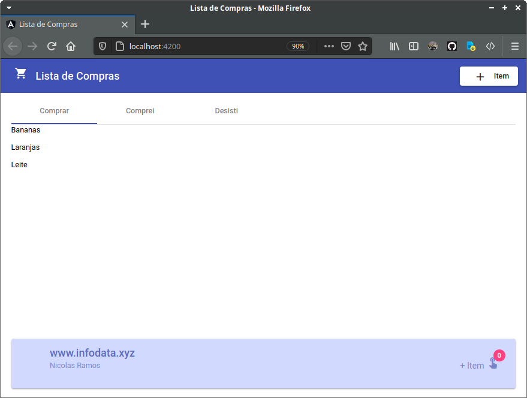

# PROJETO EM MUDANÇAS ATÉ SEXTA-FEIRA... 
# POR FAVOR AGUARDE...!!

# Lista de Compras

O projeto (lista-de-compras) foi gerado com  [Angular CLI](https://github.com/angular/angular-cli) versão 10.2.0.

## Servidor de desenvolvimento

Executando o comando `ng serve -o` para um servidor de desenvolvimento. O navegador será aberto automaticamente em `http://localhost:4200/`. O aplicativo será recarregado automaticamente se você alterar qualquer um dos arquivos.

## Componentes Angular Material

- [Tabs](https://v10.material.angular.io/components/tabs/overview)
    - Um mat-tab-group, com 3 mat-tab
        - Comprar
        - Comprei
        - Desisti
- [Toolbar](https://v10.material.angular.io/components/toolbar/overview)
    - Um mat-toobar usado como header (cabeçalho) e contendo o título da SPA
- [Icon](https://v10.material.angular.io/components/icon/overview)
    - Um mat-icon usado dentro do header, antes do título
- [Button](https://v10.material.angular.io/components/button/overview)
    - Um mat-raised-button usado ainda dentro do header, do lado direito
- [Card](https://v10.material.angular.io/components/card/overview)
    - Um mat-card usado como footer (rodapé)

## Meus componentes

- home

- compras-list

- footer

## Comunicação

- Entre o Button (dentro do Toolbar) e a lista de compras e os dados são atualizados nos Tabs

- A lista é inicialmente criada no spa-home e enviada para o spa-compras-list

 

